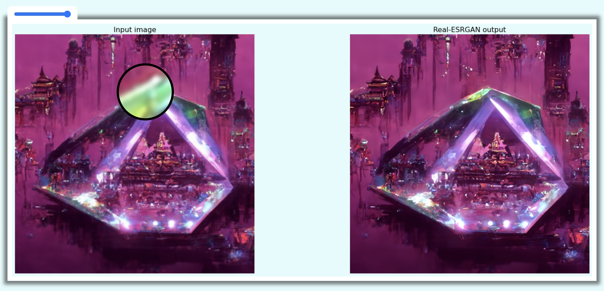

| Image Magnifier Glass | [Live Demo](url) |
|:--|:--|

## Image Magnifier Glass

In this project, I built an Image Magnifier Glass, using HTML, CSS, and JavaScript.
Mouse over the image to initiate the magnifying glass function.
Change the strength of the magnifier glass by dragging the range slider.

[W3 Source](https://www.w3schools.com/howto/tryit.asp?filename=tryhow_js_image_magnifier_glass)